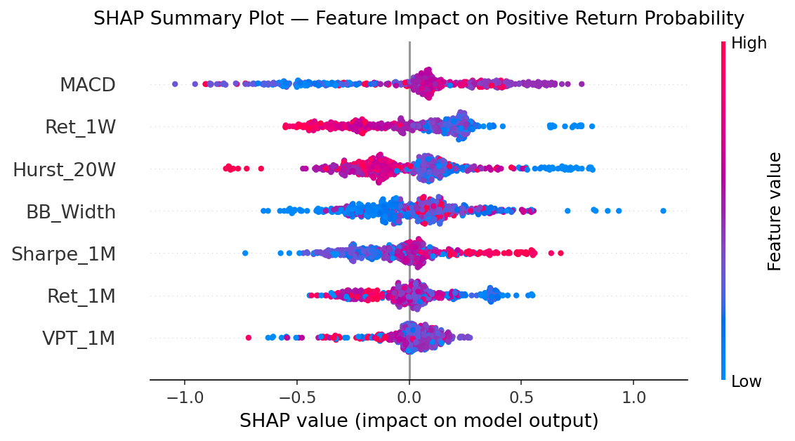

# ML Momentum Trading Pipeline: A Probabilistic Ranking Approach

## Overview
This repository contains a machine learning-based algorithmic trading pipeline designed under strict hackathon constraints: holding exactly two stocks at a 50/50 equal-weight split at all times. Because standard Markowitz Mean-Variance optimization fails under a rigid two-asset constraint, this pipeline reframes the portfolio allocation problem into a binary probabilistic ranking challenge.

## The Core "Alpha"
Absolute momentum contains dangerous market-wide beta noise. If the broader market index drops 5% in a week and a constituent stock drops only 1%, its absolute momentum is negative, but its relative momentum is massively positive. 

This pipeline strips away beta noise by:
1. **Cross-Sectional Z-Scoring:** Evaluating 1W Returns, 1M Returns, and MACD strictly relative to the 10-stock universe.
2. **Mean-Reversion Filtering:** Integrating a 20-week Hurst Exponent. If $H < 0.5$, the time-series is mathematically mean-reverting, and the model suppresses breakout buy signals to avoid traps.
3. **Volatility Compression:** Utilizing normalized Bollinger Band Width to catch momentum exactly as a volatility squeeze resolves.

## Predictive Architecture
The core engine is a **Bi-Model Soft-Voting Ensemble**:
* **Random Forest (Weight 0.4):** Acts as a variance stabilizer to prevent out-of-sample overfitting.
* **XGBoost (Weight 0.6):** Captures deep non-linear interactions between the structural volatility indicators and relative momentum.

**Isotonic Calibration:** Because the execution logic relies entirely on a hard mathematical sorting of probabilities to find the top 2 assets, the raw decision tree outputs were wrapped in Scikit-Learn's `CalibratedClassifierCV` (non-parametric Isotonic Regression) to ensure probability bounds were mathematically monotonic and reliable.

## Explainability (SHAP)
Black-box pipelines are unacceptable for institutional trading. The model's logic was verified using Shapley Additive Explanations (SHAP) cooperative game theory. 

*The surrogate map confirms the model heavily relies on short-term MACD divergence but actively suppresses signals during mean-reverting (Hurst < 0.5) regimes.*

## Validation & Out-of-Sample Results
To guarantee zero chronological look-ahead bias, standard K-Fold cross-validation was discarded in favor of a strict expanding-window walk-forward validation (Train: 2017-2022, Retrain/Test dynamically: 2023-2025). 

A strict **0.1% (10 bps) frictional transaction cost** was applied to all dynamic weekly portfolio turnover. 

| Metric | Net Portfolio (0.1% Frictional TC) |
| :--- | :--- |
| **Cumulative Return** | 173.43% |
| **Annualized Return** | 39.84% |
| **Annualized Volatility** | 26.79% |
| **Sharpe Ratio** | 1.487 |
| **Max Drawdown** | -24.29% |
| **Hit Rate** | 59.62% |